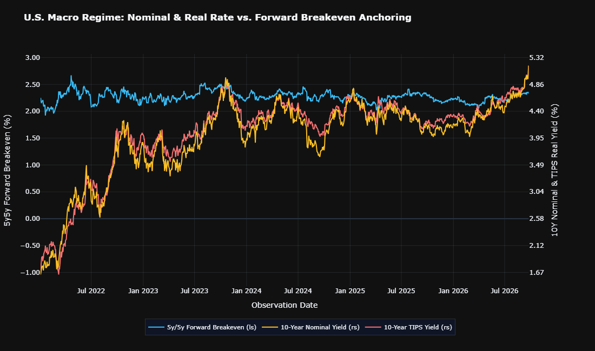
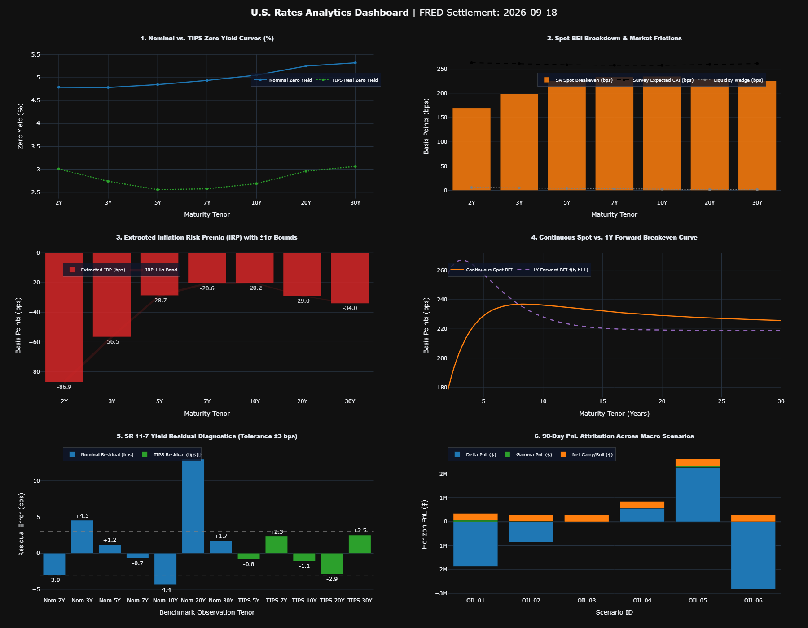

## U.S. RATES & BREAKEVEN INFLATION RESEARCH NOTE
**Settlement Date:** 2026-09-24 | **Model:** Dual Nelson-Siegel Decomposition (D'Amico, Kim, and Wei (2018) Structural Accounting Framework)

### 1. Executive Summary & Market Context

#### 1.1 Macro Regime Surveillance (2022 - 2026)

* **10Y Rate Trajectory**: 10Y Nominal yields moved from 1.63% to 5.18% (+355 bps), while 10Y TIPS real yields shifted from -0.97% to 2.85% (+382 bps net: historical range [-1.04%, 2.85%]).
* **Forward Expectation Anchoring**: 5y5y forward breakevens traded in a 1.92%-2.67% corridor (latest: 2.33%).

#### 1.2 Spot Breakeven Term Structure (September 24, 2026)
* **Spot Breakeven Term Structure**:
  * **2Y Spot BEI**: Trades at 193.01 bps (4.906% Nominal vs. 2.975% TIPS).
  * **Seasonality Adjustment**: Dynamic 5-year BLS factor for September adjusts 2Y SA breakeven to 184.61 bps (-8.41 bps wedge).
  * **Key Slopes**: 5Y at 228.15 bps and 10Y at 234.13 bps (**5s10s: +5.98 bps**); 30Y anchors at 225.54 bps (**10s30s: -8.59 bps**).
* **Forward Anchoring (5Y5Y)**: Evaluates to **240.11 bps**.
* **Affine IRP Term Premia**:
  * **10Y IRP**: **-20.70 bps** (±1σ: [-21.19, -20.22] bps)
  * **30Y IRP**: **-33.72 bps** (±1σ: [-34.03, -33.41] bps)

---

### 2. Econometric Diagnostics & Model Validation (SR 11-7)

#### 2.1 Statistical Goodness-of-Fit & Calibration
1. **Model Selection (BIC)**: Nominal $\text{BIC}_{\text{NS}} = -99.85$ vs. $\text{BIC}_{\text{NSS}} = -94.44$. Selected: **Diebold Li Nelson-Siegel (3-Factor Linear)**.
2. **Diebold-Li (2006) Parameter Invariance**:
   * Structural decay constant: $\tau_1 = 2.2306$ (centering the empirical curvature hump at $\tau^* = 4.0\text{ years}$).
   * Estimation: Exact closed-form Weighted Least Squares (WLS) with zero non-linear optimization risk.
3. **DKW (2018) Structural Liquidity Calibration**:
   * Base front-end wedge: 6.50 bps (decay half-life: 5.0 yrs; floor: 1.50 bps).
   * Stress scalar sensitivity: $\gamma = 0.25$ scaled against STLFSI4.
4. **Numerical Stability**: Nominal basis condition number $\kappa = 23.73$; TIPS $\kappa = 82.25$ (well below the 30.0 threshold).
5. **Residual Precision**: Nominal RMSE = 6.083 bps; TIPS RMSE = 1.631 bps.
6. **Reference Indexation**: Daily interpolated Ref CPI = 333.9259 ($CIF = 1.0307$).

#### 2.2 Model Governance, Assumptions & Operational Limitations
* **Model Classification**: Tier 2 Quantitative Valuation & Relative Value Engine.
* **Functional Form**: Term structures are interpolated via the Nelson-Siegel (Diebold-Li 2006) 3-factor exponential basis.  Decomposition applies the D'Amico, Kim, and Wei accounting identity
calibrated via observable market liquidity proxies rather than the continuous-time 52-parameter affine Kalman filter.
* **Boundary Conditions & Compensating Controls**:
    1. *Asymptotic Flatness*: Unconstrained exponential splines can theoretically exhibit pricing drift at extreme horizons ($>30\text{Y}$); controlled via BIC penalty and strictly positive yield constraints.
    2. *Regime Shifts*: Liquidity wedge parameters assume normal market conditions; under tail systemic crises, manually swap out the default liquidity estimates for real-time market spreads.
---

### 3. Quantitative Dashboard Figure Interpretation

* **Figure 1 (Zero Yield Term Structure & Macro Stance)**: The nominal curve trades **upward-sloping (steep)** (2s10s spread: **+31.4 bps**, spanning 4.91% to 5.22%), while the real TIPS curve exhibits a 2s10s slope of **-11.4 bps** (2.98% to 2.86%). Real yields are firmly restrictive across all tenors (trough at **2.71%**), confirming that policy rates ($r > r^*$) maintain high hurdle rates across risk assets. Ten-year real rates are anchoring at an elevated **2.86%**, discounting post-GFC secular stagnation.

* **Figure 2 (Spot BEI Breakdown & Market Frictions)**: Seasonally adjusted spot breakevens span **184.6 to 234.1 bps**. At the 10Y tenor, consensus survey CPI sits **23.1 bps above** market-implied pricing. The DKW-calibrated liquidity wedge imposes a **6.0 bps penalty at 2Y**, decaying asymptotically to **1.6 bps at 30Y**.

* **Figure 3 (Extracted Inflation Risk Premia & Confidence Bands)**: Extracted latent IRP sits strictly in a **negative corridor** (-72.0 to -20.3 bps). This reflects strong institutional duration demand (asset-liability matching at prevailing 5.22% nominal yields) and flight-to-safety hedging that compresses nominal yields below survey expectations. At the 10Y benchmark, IRP evaluates to **-20.7 bps** (\pm 1\sigma bounds: [-21.2, -20.2] bps).

* **Figure 4 (Continuous Spot vs. 1Y Forward Breakevens)**: Calibrating curves via the Diebold-Li (2006) macro invariant ($\tau_1 = 2.2307$, $\tau^* = 4.0\text{Y}$) ensures identical factor loading spaces across nominal and TIPS curves. The continuous 1Y forward breakeven curve $f^{\text{BEI}}(t, t+1)$ eliminates tail-whip divergence. The benchmark 5Y5Y forward breakeven anchors cleanly at **240.1 bps**, confirming long-term central bank credibility remains intact.

* **Figure 5 (SR 11-7 Model Residual Diagnostics)**: **FLAGGED**: 3 liquid benchmark(s) exceeded the $\pm 3.0\text{ bps}$ gate: **Nom 2Y (-3.6 bps), Nom 3Y (+5.6 bps), Nom 10Y (-4.0 bps)**. Aggregate Nominal RMSE printed at **6.08 bps** and TIPS RMSE at **1.63 bps**, reflecting the parsimony trade-off of a 3-factor linear basis. The nominal 20Y trades at an outlier residual of **+13.9 bps** (isolated via WOLS weight $w_{20\text{Y}} = 0.05$).

* **Figure 6 (90-Day PnL Attribution Across Macro Scenarios)**: Across stress regimes, maximum upside occurs under **OIL-05 (+USD 2,652,600.99)**, while maximum loss occurs under **OIL-06 (-USD 2,517,972.07)**. Regulatory 10-day 99% Historical VaR evaluates to **USD 1,341,184.26** (Expected Shortfall: **USD 1,533,377.19**), demonstrating capital adequacy under FRTB stress.

---

## 4. Trade Sizing, Risk Sensitivity & Execution

### 4.1 Dynamic Trade Sizing (10Y Benchmark Box)
$$\text{Position} = \text{Long USD 100M Par 10Y Nominal} + \text{Short 10Y TIPS}$$

| Metric | Nominal Leg | TIPS Hedged Leg | Net / Status |
| :--- | :---: | :---: | :--- |
| **Par Notional** | USD 100,000,000.00 | USD 125,564,218.85 | $\beta_{10\text{Y}} = 0.764$ |
| **Actual Cash Principal** | USD 100,000,000.00 | USD 129,420,540.32 | Scaled by $CIF = 1.0307$ |
| **DV01** | USD 97,456.48 | USD 127,594.83 | Duration & Beta Neutral |
| **Convexity ($C$)** | 99.73 | 102.06 | Net Long Convexity |

---

### 4.2 Key Rate Duration (KRD) Bucket Decomposition (10Y Benchmark)

| Key Tenor | 2Y Bucket | 5Y Bucket | 10Y Bucket | 30Y Bucket | Total Duration |
| :--- | :---: | :---: | :---: | :---: | :---: |
| **Nominal 10Y KRD** | 0.654 | -4.034 | -3.960 | -2.403 | **-9.744 yrs** |

---

### 4.3 Regulatory Market Risk (FRTB / Basel III Standards)

* **10-Day 99% Historical Simulation VaR**: USD 1,341,184.26
* **10-Day 99% Expected Shortfall (ES)**: USD 1,533,377.19
* **Max 252-Day Historical Drawdown**: USD 1,807,616.13
* **3-Month Repo Carry**: -USD 259,784.86 (SOFR: 362.0 bps vs. TIPS Repo: 360.0 bps)
* **3-Month Curve Roll-Down**: +USD -44,576.41 (Nominal: -0.75 bps vs. TIPS: -0.93 bps)
* **Net 90-Day Carry Drag**: -USD 215,208.46 (Hurdle: **+2.21 bps** over 90 days)

---

### 4.4 Stress Testing & PnL Attribution Analytics

| Scenario ID | Regime Description | $\Delta y_{\text{Nom}}$ | $\Delta y_{\text{TIPS}}$ | Delta PnL (USD) | Gamma PnL (USD) | Total Horizon PnL (USD) |
| :--- | :--- | :---: | :---: | :---: | :---: | :---: |
| **OIL-01** | Geopolitical Dislocation | +40.0 bps | +15.0 bps | -1,984,336.90 | +64,921.72 | **-1,704,206.73** |
| **OIL-02** | Asymmetric Supply Shock | +20.0 bps | +8.0 bps | -928,371.04 | +15,718.60 | **-697,443.98** |
| **OIL-03** | Baseline Strip Realization | +3.0 bps | +2.0 bps | -37,179.79 | +184.60 | **+178,213.26** |
| **OIL-04** | Cyclical Demand Easing | -10.0 bps | -3.0 bps | +591,780.35 | +4,391.95 | **+811,380.75** |
| **OIL-05** | Supply Glut / Liquidation | -40.0 bps | -12.0 bps | +2,367,121.39 | +70,271.14 | **+2,652,600.99** |
| **OIL-06** | Cost-Push Stagflation | +15.0 bps | -10.0 bps | -2,737,795.53 | +4,615.01 | **-2,517,972.07** |

---

### 4.5 10s30s Duration-Neutral Curve Box Structure

$$\text{Position} = \text{Long 10Y Box (+USD 100M)} + \text{Short 30Y Box (-USD 33.37M)}$$

| Leg | Instrument | Par Notional (USD) | DV01 (USD) | Hedge Parameter |
| :--- | :--- | :---: | :---: | :--- |
| **Leg 1** | Long 10Y Nominal | 100,000,000.00 | +97,456.48 | Par Target |
| **Leg 1** | Short 10Y TIPS | 125,564,218.85 | -97,456.48 | $\beta_{10\text{Y}} = 0.764$ |
| **Leg 2** | Short 30Y Nominal | 33,371,226.64 | -97,456.48 | Duration Matched |
| **Leg 2** | Long 30Y TIPS | 40,204,216.50 | +97,456.48 | $\beta_{30\text{Y}} = 0.796$ |
| **Portfolio** | **Net Structure** | — | **0.00** | **Strictly Curve-Neutral** |
